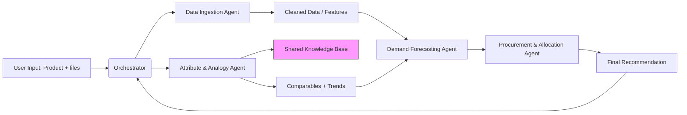

# Intelli-ODM — Multi-Agent LLM System for New Product Forecasting (Full README + Conversation)

**Note:** This README contains the complete conversation transcript from the session where the README and system design were authored. It includes the original user prompts, the Gemini-provided answer pasted by the user, code snippets, and all assistant replies. Use this document for record-keeping, reproducibility, or editing.

---

## Project README (Cleaned & Consolidated)

### Project Overview

**Intelli-ODM** is a modular, extensible multi-agent system designed to turn *vendor product descriptions + store data* into actionable procurement and store allocation recommendations.  
It combines LLM reasoning (Llama-3:8B via Ollama) with classic data science and optimization tools to solve new-product forecasting, allocation and pricing-sensitivity problems for retail.

**Goal:** Given a new article (e.g., “white cotton t-shirt, short sleeves, chest print”) and store-level sales/inventory/pricing, answer:
1. Should we procure it?  
2. How many units should we procure?  
3. Which stores should receive which quantities?  
4. What price(s) maximize sell-through and margin?

### Table of contents
- High-level Architecture  
- Agent Design & Responsibilities  
- Shared Knowledge Base  
- Repository Structure  
- Detailed File Summaries  
- Installation & Setup  
- Configuration  
- Running the System  
- Example Output  
- Design Decisions  
- Extensibility  
- Security & Deployment Notes  
- Roadmap  
- Appendices  

### High-level architecture

An orchestrated multi-agent architecture where a central **Orchestrator Agent** coordinates specialized agents. Each agent is responsible for a specific domain (data cleaning, NL attribute extraction, forecasting, optimization). The LLM (Llama-3:8B via Ollama) is used mainly for qualitative reasoning, attribute standardization, model selection suggestions, and human-readable explanation generation. Quantitative work (forecasting, optimization) is handled by numerical libraries (Pandas, NumPy, Scikit-learn, Prophet, PuLP/CVXPY).

```
User Input (Vendor product + Store files)
        ↓
  Orchestrator Agent
        ↓
  ┌────────────┬──────────────┬───────────────┐
  │ Data       │ Attribute &  │ Demand        │
  │ Ingestion  │ Analogy      │ Forecasting   │
  │ Agent      │ Agent        │ Agent         │
  └────────────┴──────────────┴───────────────┘
                       ↓
         Procurement & Allocation Agent
                       ↓
             Final Recommendation (Report)
```

### Agent design & responsibilities

#### Data Ingestion Agent
**Purpose:** Validate, clean, normalize and feature-engineer incoming tabular inputs.

**Responsibilities**
- Validate file formats and completeness (product catalog, sales, inventory, pricing).
- Normalize column names and data types.
- Convert raw product descriptions into initial structured attributes if possible (fallback to LLM agent).
- Feature engineering:
  - Sales velocity (units/day / units/week / seasonality flags)
  - Avg price and price bands by store
  - Days-of-stock, sell-through % historical
  - Store tier or cluster (e.g., Tier-1, Tier-2, Outlet)
- Output standardized `DataFrame` objects and a features dictionary.

**Key functions**
```py
validate(files) -> validation_report
structure(raw_data) -> {sales_df, inventory_df, price_df, products_df}
feature_engineering(df) -> engineered_features
run(files) -> cleaned_structured_features
```

#### Attribute & Analogy Agent
**Purpose:** Convert natural language product descriptions into structured attributes and find analogous SKUs from the Shared Knowledge Base.

**Responsibilities**
- Use the LLM to parse free-text product descriptions into structured attributes (Material, Color, Sleeve, Pattern, GSM, Fit, Gender, Category).
- Standardize synonyms (e.g., “super soft cotton” → `Material: Cotton`, `Finish: Brushed`).
- Generate embeddings / semantic keys and query the Shared Knowledge Base for top-N comparable SKUs.
- Produce a short trend/contextual analysis (e.g., “cotton tees with chest prints are trending in Q1 in Tier-1 markets”).
- Provide comparables plus their store-level historical performance slices.

**Key functions**
```py
standardize_attributes(product_description) -> attrs_json
find_comparable_products(attrs, top_n=5) -> [SKU, similarity_score]
analyze_trends(attrs) -> trend_signals
run(product_description) -> (attrs, comparables, trends)
```

#### Demand Forecasting Agent
**Purpose:** Generate store-level probabilistic forecasts for the new product using comparables and store contexts.

**Approach**
- LLM assists in model selection (analogy vs time-series vs ML regression) based on the amount/quality of comparable data.
- Quantitative forecasting executed with specialized libraries.
- Provide confidence intervals and price sensitivity analysis.

**Forecast types**
- Analogy-based forecast — scale comparable SKUs by attribute similarity and adjust by store performance differences.
- Time-series (if comparable SKU has strong history at the store).
- Demand distribution across stores (store-specific expected units, variance).

**Key functions**
```py
select_model(comparables) -> model_choice
forecast(sales_data, inventory_data, price_data) -> {store: {mean, low, high}}
sensitivity_analysis(forecast, price_options) -> price_elasticity_results
run(comparables, sales_df, inventory_df, price_df, price_options) -> (forecast, sensitivity)
```

#### Procurement & Allocation Agent
**Purpose:** Translate forecasts into procurement quantity and store allocation while respecting constraints.

**Responsibilities**
- Validate business constraints: budget, MOQ, vendor lead time, store capacity, replenishment rules.
- Build optimization model:
  - Objective options: maximize expected revenue, maximize expected sell-through, minimize expected stockout, optimize margin.
  - Constraints: MOQ, pack sizes, transportation limits, store max capacity, minimum display quantities.
- Solve optimization using PuLP / OR-Tools / CVXPY.
- Generate a readable, actionable recommendation including flags (e.g., “Reduce order size to avoid markdown risk”).

**Key functions**
```py
check_constraints(data) -> constraint_report
optimize(demand_forecast, inventory, price, constraints) -> allocation_plan
generate_recommendation(result) -> human_readable_recommendation
run(demand_forecast, inventory, price) -> recommendation
```

#### Orchestrator Agent
**Purpose:** Coordinate the full workflow and synthesize final output.

**Responsibilities**
- Accepts the user request and all input files.
- Invokes Data Ingestion → Attribute & Analogy → Forecasting → Procurement agents in order.
- Maintains short-term context and logs between agents.
- Produces a final report (JSON + human readable textual justification).
- Stores artifacts back to Shared Knowledge Base for future learning.

**Example orchestration flow**
1. Accept `input_data` with file paths and product description.
2. `clean_data = data_ingestion.run(files)`
3. `attrs, comparables, trends = attribute_agent.run(description)`
4. `forecast, sensitivity = demand_agent.run(comparables, clean_data.sales, clean_data.inventory, clean_data.price, price_options)`
5. `final_rec = procurement_agent.run(forecast, clean_data.inventory, clean_data.price)`
6. Return `final_rec` with explanatory notes.

### Shared Knowledge Base

**Role:** A persistent store for SKU metadata, embeddings, historical sales patterns and trend summaries. Enables semantic search and quick retrieval of comparables.

**Capabilities**
- Insert new SKUs with attributes + sales vectors.
- Vector search (semantic similarity) for analogous products.
- Store agent outputs (forecasts, decisions) for audit & retraining.

**Storage options**
- ChromaDB / FAISS / Weaviate / Pinecone / pgvector (Postgres)  
Choose depending on infra (on-prem vs cloud) and scale.

**API sketch**
```py
class SharedKnowledgeBase:
    def store(key, document, metadata) -> None
    def retrieve(query, top_n=5) -> [documents]
    def query_vector(vector, top_n=5) -> [documents]
```

### Repository structure

```
intelli-odm/
├── agents/
│   ├── data_ingestion_agent.py
│   ├── attribute_analogy_agent.py
│   ├── demand_forecasting_agent.py
│   └── procurement_allocation_agent.py
├── orchestrator.py
├── shared_knowledge_base.py
├── requirements.txt
├── README.md
└── examples/
    ├── sample_input/
    │   ├── products.csv
    │   ├── sales.csv
    │   ├── inventory.csv
    │   └── price.csv
    └── sample_run.ipynb
```

### Detailed file summaries

- `agents/data_ingestion_agent.py`  
  Validate files, normalize, compute features (velocity, price stats), return cleaned `DataFrame`s.

- `agents/attribute_analogy_agent.py`  
  Uses Llama client to parse NL → structured attributes, query KB for comparables, return trend notes.

- `agents/demand_forecasting_agent.py`  
  Selects & executes forecasting approach, returns probabilistic store-level forecasts and sensitivity.

- `agents/procurement_allocation_agent.py`  
  Performs constraint checks, formulates and solves allocation optimization, returns final allocation.

- `orchestrator.py`  
  Bootstraps the system, creates agent instances, executes `run_workflow(input_data, price_options)` and returns result.

- `shared_knowledge_base.py`  
  Wraps vector DB operations and persistent metadata storage.

- `requirements.txt`  
  List of Python dependencies (Pandas, NumPy, scikit-learn, prophet/prophet-lite, puLP/cvxpy, ollama-client, sentence-transformers/embedding lib, vector DB SDK).

### Installation & setup

> This section assumes a Unix-like environment (Linux, macOS). Adapt commands for Windows.

1. **Clone the repo**
```bash
git clone https://github.com/your-org/intelli-odm.git
cd intelli-odm
```

2. **Create & activate virtualenv**
```bash
python -m venv .venv
source .venv/bin/activate
```

3. **Install Python dependencies**
```bash
pip install -r requirements.txt
```

4. **Install Ollama and pull the model**
- Install Ollama (follow official instructions: https://ollama.com/install)
```bash
# macOS using brew (example)
brew install ollama
# Pull local copy of the model
ollama pull llama3:8b
```

5. **Configure Shared Knowledge Base**
- Choose a vector DB (Chroma, FAISS, pgvector, Weaviate).
- Update `shared_knowledge_base.py` with connection details and initialize the index.

6. **Environment variables / config**
Create `.env` or config file (example placeholders):
```
KB_TYPE=chroma
KB_HOST=localhost
KB_PORT=8000
OLLAMA_URL=http://localhost:11434
OLLAMA_MODEL=llama3:8b
```

### Running the system — example

Minimal example usage:

```py
from orchestrator import OrchestratorAgent
from ollama_client import OllamaClient  # hypothetical wrapper

client = OllamaClient(base_url="http://localhost:11434", model="llama3:8b")
orc = OrchestratorAgent(llama_client=client, constraint_params={
    "budget": 1000000, "MOQ": 200, "pack_size": 20
})

input_data = {
    "files": {
        "products": "examples/sample_input/products.csv",
        "sales": "examples/sample_input/sales.csv",
        "inventory": "examples/sample_input/inventory.csv",
        "price": "examples/sample_input/price.csv"
    },
    "product_description": "White cotton t-shirt, short sleeves, chest print, 180 GSM"
}

price_options = [299, 349, 399]
final_recommendation = orc.run_workflow(input_data, price_options)
print(final_recommendation)
```

### Example output (sample report)

```json
{
  "article": "White Cotton T-Shirt (Chest Print)",
  "attributes": {
    "material": "Cotton",
    "color": "White",
    "sleeve": "Short",
    "print": "Chest Print",
    "gsm": 180
  },
  "comparables": [
    {"sku": "TS-114", "similarity": 0.88},
    {"sku": "TS-203", "similarity": 0.81}
  ],
  "forecast": {
    "store_001": {"expected_60d": 220, "low": 150, "high": 290},
    "store_002": {"expected_60d": 190, "low": 120, "high": 260}
  },
  "pricing_sensitivity": {
    "299": {"expected_units": 13200, "expected_revenue": 3936000},
    "349": {"expected_units": 12400, "expected_revenue": 4320000}
  },
  "procurement": {
    "total_qty": 12400,
    "allocation": {
      "store_001": 220,
      "store_002": 190
    }
  },
  "recommendation_text": "Procure 12400 units, recommended base price ₹349. Prefer allocation to Tier 1 stores; watch price elasticity > ₹399."
}
```

### Design decisions & rationale

- **LLM (Llama-3:8B) via Ollama runs locally** — ensures privacy and on-prem compliance.
- **LLM for qualitative tasks** — attribute parsing, analogies, promptable model selection and explanations; quantitative calculations handled by dedicated libraries to ensure interpretability & repeatability.
- **Separation of concerns (agents)** — allows incremental upgrades: replace forecasting algorithm or optimize solver independently.
- **Shared Knowledge Base** — centralizes learnings, speeds up similarity searches, enables continuous improvement.

### Extensibility & future enhancements

**Short-term**
- Robust prompt templates and few-shot examples for attribute parsing.
- Add AutoML to select forecasting model.
- Add monitoring for forecast accuracy and allocation performance.

**Medium-term**
- Reinforcement Learning (RL) agent to learn allocation strategies over time.
- Closed-loop feedback: feed sold-through data back to KB and retrain models.
- Web UI (Streamlit/React + FastAPI) for planners to run what-ifs and visualise allocations.

**Long-term**
- Multi-product assortment optimization (joint allocation across related SKUs).
- Integration with PLM, ERP (SAP/Oracle) for automated PO creation.
- Dynamic pricing agent feeding live promotions.

### Security & deployment notes

- **On-prem model hosting:** Ollama + Llama-3:8B can run fully on your infra — reduces data leakage risk.
- **Data governance:** Ensure PII scrubbed from vendor descriptions (if present) before storing in KB.
- **Access control & audit logs:** Log agent decisions and any prompts sent to LLM for auditability.
- **Secrets management:** Use Vault or environment variables for KB credentials / Ollama endpoints.
- **Scaling:** Vector DB and optimization solvers should be scaled out as store count and SKU volume grows.

### Roadmap (phases)

**Phase 1 — MVP**
- Attribute extraction (LLM)
- Comparable SKU retrieval (KB)
- Analogy-based forecast + simple allocation rules

**Phase 2 — Core**
- Store-level probabilistic forecasting (ML/time-series)
- Constraint-aware optimization (PuLP/CVXPY)
- Sensitivity analysis for pricing

**Phase 3 — Enterprise**
- Daily batch runs, reconciliation with sales
- RL allocation agent
- Full PLM/ERP integrations and web UI

### Appendices

#### Mermaid architecture diagram



#### Typical data schemas (CSV / JSON)

**products.csv**
```
product_id, vendor_sku, description, category, color, material, size_set
P123, V-001, "White cotton t-shirt, chest print, short sleeve", TSHIRT, White, Cotton, S,M,L,XL
```

**sales.csv**
```
date, store_id, sku, units_sold, revenue
2025-09-01, store_001, TS-114, 2, 698
```

**inventory.csv**
```
store_id, sku, on_hand, in_transit
store_001, TS-114, 45, 0
```

**price.csv**
```
store_id, sku, price, markdown_flag
store_001, TS-114, 349, False
```

#### Agent prompt examples (templates)

**Attribute extraction (LLM prompt template)**
```
Extract structured attributes from this product description. Provide JSON with keys:
material, color, pattern, sleeve, fit, gsm, category, tags.

Description:
"White cotton t-shirt, chest print, short sleeves, 180 GSM"
```

**Model selection prompt (LLM assisting forecasting agent)**
```
Given the following comparable SKUs and their historical sales volume, recommend whether to use:
1. Analogy-based scaling
2. Per-store time-series model
3. Regression-based model with store features

Explain why and provide recommended parameters.
```

---

---

# **intelli-odm — Multi-Agent LLM System for New Product Forecasting**  
### *Intelligent Orchestrated Demand Management using Llama3-8B (Ollama)*

intelli-odm is a **multi-agent, LLM-powered forecasting and allocation system** designed for **buying, merchandising, and planning teams**.  
It automates the full decision pipeline — from **product attribute understanding** to **store-level forecasting** and **procurement optimization**.

The system uses:

- **Ollama** — running *Llama3:8B*  
- **Python Agents** — for forecasting, optimization & orchestration  
- **Shared Knowledge Base** — for SKU, trend and sales context  
- **Hybrid AI design** — LLM reasoning + quantitative ML/statistical tools

---

# 🚀 **Core Problem This System Solves**

Vendors submit *new articles* such as:

> *White cotton t-shirt, short sleeves, front chest print, 180 GSM*

Retailers also provide:

- Store-level **sales history**
- Store-level **inventory**
- Store-level **price**
- Procurement constraints (budget, MOQ, capacities)

The system answers:

### **👇 Key Outcomes**
1. **Should we procure this article?**
2. **How much to buy?**
3. **Which stores should receive how many units?**
4. **At what expected sell-through and margins?**

This is achieved using **4 specialized agents + an orchestrator**.

---

# 🧠 **System Architecture**

```
                           +-----------------------+
                           |     User Input        |
                           | Product + Sales Data  |
                           +-----------+-----------+
                                       |
                                       v
               +------------------ Orchestrator Agent -------------------+
               | Coordinates agents, manages workflow, synthesizes output |
               +-----------+----------------+-----------------------------+
                           |                |
                           v                v
           +---------------+--+         +---+------------------+
           | Data Ingestion |         | Attribute & Analogy    |
           |     Agent      |         |       Agent            |
           +-------+--------+         +----------+-------------+
                   |                             |
                   v                             v
   +---------------+-------+         +------------+----------------+
   | Cleaned & structured  |         | Comparable SKUs + Trends    |
   |    dataframes         |         +------------+----------------+
   +---------------+-------+                      |
                   |                              v
                   |          +-------------------+----------------+
                   |          | Demand Forecasting Agent          |
                   |          +-------------------+----------------+
                   |                              |
                   v                              v
          +--------+----------------+     +-------+---------------+
          | Procurement & Allocation |     | Store-level Forecast |
          |         Agent            |     | + Sensitivity Output |
          +--------------+-----------+     +-----------------------+
                         |
                         v
               +---------+----------------+
               |  Final Allocation Plan   |
               | Procurement + Store Map  |
               +--------------------------+
```

---

# 🤖 **Agents Overview**

## **1. Data Ingestion Agent**
Responsible for:

- Validating product, sales, inventory, pricing inputs  
- Standardizing formats (JSON/DataFrames)  
- Basic feature engineering (sales velocity, avg price, store tiering)

**Output:**  
`{ sales_df, inventory_df, price_df, engineered_features }`

---

## **2. Attribute & Analogy Agent**
Uses Llama3-8B to:

- Parse natural-language product descriptions  
- Standardize attributes (e.g., Fabric=Cotton, Color=White, Sleeve=Short)  
- Retrieve comparable SKUs from Shared Knowledge Base  
- Analyze trends (style, season, colors, silhouettes)

**Output:**  
`{ comparables: [SKU1, SKU2...], trend_signals }`

---

## **3. Demand Forecasting Agent**
Combines quantitative and LLM reasoning:

- Chooses forecasting model based on comparable data  
- Produces **store-level demand forecast** (base + optimistic + pessimistic)  
- Performs **price sensitivity** simulation  

**Output:**  
`{ forecast_by_store, price_elasticity_curves }`

---

## **4. Procurement & Allocation Agent**
Responsible for:

- Budget, capacity, MOQ constraint validation  
- Inventory-aware **allocation optimization**  
- Generating the **final recommended Buy Qty + Store Split**

Uses solvers like:

- PuLP  
- OR-Tools  
- CVXPY  

**Output:**  
`{ procurement_qty, allocation_map_per_store }`

---

## **5. Orchestrator Agent**
Master controller:

- Manages workflow  
- Passes data across agents  
- Synthesizes final recommendation  
- Produces user-friendly text output  

---

# 📂 **Project Structure**

```
intelli-odm/
│
├── agents/
│   ├── data_ingestion_agent.py
│   ├── attribute_analogy_agent.py
│   ├── demand_forecasting_agent.py
│   └── procurement_allocation_agent.py
│
├── orchestrator.py
├── shared_knowledge_base.py
├── requirements.txt
└── README.md
```

---

# ⚒️ **Installation**

### **1. Clone repository**
```bash
git clone https://github.com/your-org/intelli-odm.git
cd intelli-odm
```

### **2. Install Python packages**
```bash
pip install -r requirements.txt
```

### **3. Install Ollama**
Mac/Linux:
```bash
curl -fsSL https://ollama.com/install.sh | sh
```

### **4. Pull Llama3**
```bash
ollama pull llama3:8b
```

---

# 🧩 **Configuration**

### **Shared Knowledge Base**
Configure the vector DB (Chroma/Weaviate/Pinecone) inside:

```
shared_knowledge_base.py
```

### **Model Client**
Your `OrchestratorAgent` receives:

```python
llama_client = Ollama(model="llama3:8b")
```

---

# ▶️ **Running the Workflow**

### 1. Prepare Input Data
```python
input_data = {
    "files": {
        "products": "products.csv",
        "sales": "sales.csv",
        "inventory": "inventory.csv",
        "price": "price.csv"
    },
    "product_description": "White cotton tshirt, chest print, short sleeves, 180 GSM"
}

price_options = [299, 349, 399]
```

### 2. Run Orchestrator
```python
from orchestrator import OrchestratorAgent
client = Ollama(model="llama3:8b")

orc = OrchestratorAgent(llama_client=client, constraint_params={
    "budget": 1000000,
    "MOQ": 200,
    "store_capacity_rules": {...}
})

recommendation = orc.run_workflow(input_data, price_options)
print(recommendation)
```

---

# 📊 **Example Output**

```
Final Recommendation for Article: White Cotton T-Shirt

• Suggested Procurement Qty: 12,400 units  
• Estimated Sell-through (60 days): 78%  
• Base Price Recommended: ₹349  

Store Allocation:
-----------------------------------
Store 01 → 220 units
Store 02 → 190 units
Store 03 → 140 units
...
Store 28 → 60 units
-----------------------------------

Rationale:
- Strong comparables found (SKUs: TS-114, TS-203)
- Cotton tees + chest print trending in Tier 1 & 2 cities
- High elasticity beyond ₹399 → avoid overpricing
```

---

# 🧱 **Extending the System**

| Feature | Description |
|--------|-------------|
| **Reinforcement Learning for Allocation** | Use RL agents to learn optimal distribution strategies over seasons |
| **Auto-updating Knowledge Base** | After each season, automatically feed sales back into KB |
| **LLM-generated Vendor Negotiation Inputs** | AI-generated target costs & margins |
| **Multi-Agent Communication Memory** | Allow agents to reference past runs to improve stability |
| **Streamlit/WebUI** | Build a visual interface for planners & buyers |

---

# 🔒 **Data Privacy & Security**

- No product-level data leaves your environment  
- Llama3 runs **fully locally** on Ollama  
- You can deploy the entire solution on-prem  

---

# 🏁 **Summary**

intelli-odm is a modular, scalable multi-agent system built for retail buying & planning teams.  
It leverages LLM reasoning + quantitative forecasting to automate:

- Attribute understanding  
- Comparable SKU identification  
- Demand forecasting  
- Procurement planning  
- Store allocation optimization  

You now have both:
✔ System architecture  
✔ Agent code skeleton  
✔ A complete, ready-to-ship README.md

---

**User:**  
Convert the above into markdown format

**Assistant:**  
Here is your **README.md** converted into **clean, production-ready Markdown format** with headings, tables, code blocks, and proper structure.

---

# **Intelli-ODM: Multi-Agent LLM System for New Product Forecasting**  
_A modular, extensible, multi-agent architecture powered by Ollama (Llama-3 8B) for fashion retail forecasting, procurement planning, and store allocation._

---

## **📌 Overview**

**Intelli-ODM (On-Demand Merchandising)** is a multi-agent LLM-based system built to solve the hardest problem in fashion retail:  
### **“Given a new product with attributes, what should we buy, how much should we buy, and which stores should we send it to?”**

The system uses:

- **Llama-3 8B via Ollama** for reasoning, attribute analysis, and workflow orchestration  
- **Python agents** for quantitative forecasting & optimization  
- **A shared knowledge base** for product embeddings, historical sales, and trend data  
- **A hierarchical multi-agent architecture** for accuracy, modularity, and extensibility

This repository contains the scaffolding for all major agents, the orchestrator, and the shared knowledge base.

---

## **🧠 Multi-Agent Architecture**

The system follows a **Hierarchical Orchestrator Pattern** with 4 specialized agents:

```
                    ┌──────────────────────┐
                    │  Orchestrator Agent  │
                    └──────────┬───────────┘
                               │
 ┌─────────────────────────────┼────────────────────────────────┐
 │                             │                                │
 ▼                             ▼                                ▼
Data Ingestion Agent   Attribute & Analogy Agent      Demand Forecasting Agent
                                │                                ▼
                                └───────────► Procurement & Allocation Agent
```

Each agent focuses on a precise part of the forecasting lifecycle.

---

## **📂 Repository Structure**

```
intelli-odm/
├── agents/
│   ├── data_ingestion_agent.py
│   ├── attribute_analogy_agent.py
│   ├── demand_forecasting_agent.py
│   └── procurement_allocation_agent.py
│
├── orchestrator.py
├── shared_knowledge_base.py
├── requirements.txt
└── README.md
```

---

## **🤖 Agent Responsibilities**

### ### **1. Data Ingestion Agent (`DataIngestionAgent`)**  
Purpose: **Clean, validate, and structure all incoming data**

Handles:
- Vendor product lists  
- Store-level sales data  
- Inventory & pricing  
- Historical merchandising data  

Key functions:
- `validate()` → checks accuracy & consistency  
- `structure()` → normalizes formats (CSV → DataFrame/JSON)  
- `feature_engineering()` → computes:
  - sales velocity
  - average price
  - store classification metrics

---

### **2. Attribute & Analogy Agent (`AttributeAnalogyAgent`)**  
Purpose: **Convert natural language product attributes into structured data and find comparable SKUs**

Powered heavily by **Llama-3**.

Capabilities:
- Standardize fashion attributes  
- Extract: color, sleeve type, neckline, prints, fabric, style  
- Query the shared knowledge base to retrieve “analogous products”  
- Trend analysis using LLM insights, reports, descriptions  

Output:
- Structured attributes JSON  
- Top comparable SKUs  
- Trend signals  

---

### **3. Demand Forecasting Agent (`DemandForecastingAgent`)**

Purpose: **Predict store-level demand for the new product**

Tasks:
- Select best forecasting model using LLM reasoning  
- Run:
  - Analogy-based forecasting  
  - Regression or clustering workflows  
  - Time-series models (Prophet, ARIMA, etc.)  
- Generate:
  - 30–90 day demand forecast per store  
  - High/low confidence bands  
- Run **price sensitivity analysis**

---

### **4. Procurement & Allocation Agent (`ProcurementAllocationAgent`)**

Purpose: **Decide how much to procure and where to send it**

Input:
- Forecasts  
- Inventory  
- Constraints (MOQ, budgets, store capacity, price)  

Capabilities:
- Optimization solver (PuLP/CVXPy)  
- Compute:
  - Optimal procurement quantity  
  - Allocations to each store  
  - Profit maximization / inventory minimization  

Output:
- Final actionable recommendation

---

### **5. Orchestrator (`OrchestratorAgent`)**

The brain of the system.  
Controls workflow end-to-end:

### **Workflow Steps**

1. **Ingest data**  
2. **Convert attributes** using LLM reasoning  
3. **Find analogous SKUs**  
4. **Forecast demand**  
5. **Optimize procurement & allocation**  
6. **Return a final report**

The orchestrator ensures that each agent receives the right data in the right sequence.

---

## **⚙️ Example Workflow**

```python
orchestrator = OrchestratorAgent(llama_client, constraint_params)

result = orchestrator.run_workflow(
    input_data={
        "files": ["products.csv", "sales.csv", "inventory.csv"],
        "product_description": "White cotton t-shirt with short sleeves and chest print"
    },
    price_options=[399, 449, 499]
)

print(result)
```

Produces:
- Total procurement qty  
- Allocation to each store  
- Pricing recommendations  
- Expected revenue  

---

## **📦 Installation**

### **1. Clone repository**
```bash
git clone https://github.com/your-org/intelli-odm.git
cd intelli-odm
```

### **2. Install dependencies**
```bash
pip install -r requirements.txt
```

### **3. Install & run Ollama**
```bash
brew install ollama
ollama pull llama3:8b
```

### **4. Start the system**
(Example placeholder)
```bash
python orchestrator.py
```

### Mermaid architecture diagram
```
flowchart LR
  A[User Input: Product + files] --> B(Orchestrator)
  B --> C[Data Ingestion Agent]
  B --> D[Attribute & Analogy Agent]
  D --> KB[Shared Knowledge Base]
  C --> E[Cleaned Data / Features]
  D --> F[Comparables + Trends]
  E --> G[Demand Forecasting Agent]
  F --> G
  G --> H[Procurement & Allocation Agent]
  H --> I[Final Recommendation]
  I --> B
  style KB fill:#f9f,stroke:#333,stroke-width:1px
  ```