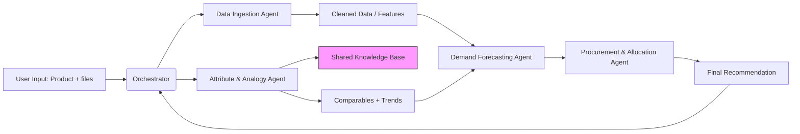

# Intelli-ODM — Multi-Agent LLM System for New Product Forecasting

_Intelligent Orchestrated Demand Management using Llama3-8B (Ollama)_

---

## 📌 Project Overview

Intelli-ODM is a modular, extensible multi-agent system that transforms vendor product descriptions and store data into actionable procurement and store allocation recommendations. It combines local Llama3-8B LLM reasoning (via Ollama) with data science and optimization tools to automate forecasting, allocation, and pricing-sensitivity in retail.

### Key Business Questions Answered
1. **Should we procure this article?**
2. **How many units should we procure?**
3. **Which stores should receive which quantities?**
4. **What price(s) maximize sell-through and margin?**

## Table of Contents
- [System Architecture](#system-architecture)
- [Agent Design & Responsibilities](#agent-design--responsibilities)
- [Shared Knowledge Base](#shared-knowledge-base)
- [Repository Structure](#repository-structure)
- [Installation & Setup](#installation--setup)
- [Configuration](#configuration)
- [Running the System](#running-the-system)
- [Example Output](#example-output)
- [Design Decisions & Rationale](#design-decisions--rationale)
- [Extensibility & Roadmap](#extensibility--roadmap)
- [Appendix: Data Schemas, Prompts, & Mermaid Diagram](#appendix)

---

## 🏗️ System Architecture

Hierarchical multi-agent pattern where a **central Orchestrator Agent** coordinates specialized agents. LLMs, quantitative forecasting, and optimization libraries are used together:

```
+---------------------+
|    User Input       |
| Product + Sales     |
+----------+----------+
           |
           v
+------------------------------+
| Orchestrator Agent           |
| (workflow, synthesis)        |
+---------------------+--------+
          |           |
          v           v
+---------+--+   +----+----------------+
| Data       |   | Attribute &         |
| Ingestion  |   | Analogy Agent       |
| Agent      |   +---------------------+
+-----+------+                 |
      |                        v
      |              +---------+--------------+
      |              | Demand Forecasting     |
      +------------->| Agent                  |
                     +---------+--------------+
                               |
                               v
                   +-----------+-----------+
                   | Procurement &         |
                   | Allocation Agent      |
                   +-----------+-----------+
                               |
                               v
            +------------------+------------------+
            |   Final Recommendation (Report)     |
            +-------------------------------------+
```

---

## 🤖 Agent Design & Responsibilities

### 1. Data Ingestion Agent
- Validates product, sales, inventory, pricing data
- Standardizes formats (Pandas DataFrames, JSON)
- Conducts basic feature engineering (sales velocity, avg price, tiers)
- **Output:** `{ sales_df, inventory_df, price_df, engineered_features }`

### 2. Attribute & Analogy Agent
- Uses Llama3-8B to parse natural language descriptions
- Standardizes attributes (e.g., Fabric=Cotton, Color=White)
- Retrieves comparable SKUs from Knowledge Base
- Analyzes product/trend context
- **Output:** `{ comparables: [SKU1, SKU2...], attributes, trend_signals }`

### 3. Demand Forecasting Agent
- Selects best forecasting model with LLM support
- Uses historical/comparable data for store-level forecast
- Provides probabilistic bounds/price sensitivity analysis
- **Output:** `{ forecast_by_store, price_elasticity_curves }`

### 4. Procurement & Allocation Agent
- Considers demand, constraints (budget, MOQ, capacities)
- Runs allocation optimization solver (e.g., PuLP/CVXPY)
- Generates clear recommendations for buy + allocation
- **Output:** `{ procurement_qty, allocation_map_per_store }`

### 5. Orchestrator Agent
- Runs workflow: Ingestion → Attribute/Analogy → Demand → Procurement
- Passes data/files between agents
- Produces final report (JSON + human-friendly summary)

---

## 📡 Shared Knowledge Base
A persistent store (e.g., vector DB) for all:
- SKU metadata, attributes, and vectors
- Historical sales patterns
- Trend/context signals
- Agent outputs for audit and retraining

**Example API Sketch:**
```python
class SharedKnowledgeBase:
    def store(key, document, metadata) -> None
    def retrieve(query, top_n=5) -> [documents]
    def query_vector(vector, top_n=5) -> [documents]
```

---

## 📂 Repository Structure
```
intelli-odm/
├── agents/
│   ├── data_ingestion_agent.py
│   ├── attribute_analogy_agent.py
│   ├── demand_forecasting_agent.py
│   └── procurement_allocation_agent.py
├── orchestrator.py
├── shared_knowledge_base.py
├── requirements.txt
├── README.md
└── examples/
    ├── sample_input/
    │   ├── products.csv
    │   ├── sales.csv
    │   ├── inventory.csv
    │   └── price.csv
    └── sample_run.ipynb
```

---

## ⚒️ Installation & Setup

1. **Clone repository**
```bash
git clone https://github.com/your-org/intelli-odm.git
cd intelli-odm
```

2. **Create & activate env, install dependencies**
```bash
python -m venv .venv
source .venv/bin/activate
pip install -r requirements.txt
```

3. **Install Ollama and Llama3**
```bash
brew install ollama
ollama pull llama3:8b
```

4. **Configure Knowledge Base**  
Update `shared_knowledge_base.py` with your vector DB details. Set environment variables as necessary.

---

## ⚙️ Configuration

- Create `.env` or set environment variables:
```
KB_TYPE=chroma
KB_HOST=localhost
KB_PORT=8000
OLLAMA_URL=http://localhost:11434
OLLAMA_MODEL=llama3:8b
```
- In your orchestrator, specify constraint params and price options:
```python
constraint_params = {
    "budget": 1_000_000,
    "MOQ": 200,
    "pack_size": 20,
    "lead_time_days": 14,
    "store_capacity_rules": {"max_shelf": 200, "min_display": 10}
}
price_options = [299, 349, 399]
```

---

## ▶️ Running the System

```python
from orchestrator import OrchestratorAgent
# from ollama_client import OllamaClient  # example wrapper

client = OllamaClient(base_url="http://localhost:11434", model="llama3:8b")
orc = OrchestratorAgent(llama_client=client, constraint_params=constraint_params)

input_data = {
    "files": {
        "products": "examples/sample_input/products.csv",
        "sales": "examples/sample_input/sales.csv",
        "inventory": "examples/sample_input/inventory.csv",
        "price": "examples/sample_input/price.csv",
    },
    "product_description": "White cotton t-shirt, short sleeves, chest print, 180 GSM",
}

final_rec = orc.run_workflow(input_data, price_options)
print(final_rec)
```

---

## 📊 Example Output
```json
{
  "article": "White Cotton T-Shirt (Chest Print)",
  "attributes": {
    "material": "Cotton",
    "color": "White",
    "sleeve": "Short",
    "pattern": "Chest Print",
    "gsm": 180
  },
  "comparables": [
    {"sku": "TS-114", "similarity": 0.88},
    {"sku": "TS-203", "similarity": 0.81}
  ],
  "forecast": {
    "store_001": {"expected_60d": 220, "low": 150, "high": 290},
    "store_002": {"expected_60d": 190, "low": 120, "high": 260}
  },
  "pricing_sensitivity": {
    "299": {"expected_units": 13200, "expected_revenue": 3936000},
    "349": {"expected_units": 12400, "expected_revenue": 4320000}
  },
  "procurement": {
    "total_qty": 12400,
    "allocation": {
      "store_001": 220,
      "store_002": 190
    }
  },
  "recommendation_text": "Procure 12400 units, recommended base price ₹349. Prefer allocation to Tier 1 stores; avoid overpricing above ₹399."
}
```

---

## 💡 Design Decisions & Rationale
- Llama-3:8B (Ollama) is used only for qualitative/analytical operations; quantitative operations use established scientific libraries.
- Clean separation of agent responsibilities for modular upgrades and testing.
- Shared Knowledge Base centralizes historical data, enables semantic retrieval, and future retraining.
- End-to-end workflow is transparent and reproducible.

---

## 🚀 Extensibility & Roadmap
### Short-Term
- Proper prompt templates, prompt engineering for extractive tasks.
- AutoML/LLM-driven model selection.
- Monitoring/reporting for accuracy.

### Mid-Term
- RL agents for optimal allocation.
- Automatic retraining loop from post-season data.
- Simple web UI for planners.

### Long-Term
- Joint multi-product assortment optimization.
- Real-time ERP/PLM system integration.
- Dynamic-live pricing agent.

---

## 🔒 Security & Deployment Notes
- No product data leaves your environment; Ollama/Llama3 runs locally.
- Knowledge Base can run on-prem (e.g., Chroma, FAISS, pgvector).
- PII scrubbing recommended before storing vendor descriptions.
- Environment/configuration secrets via `.env` or system vaults.

---

## Appendix

### Typical Data Schemas
- **products.csv**
```csv
product_id, vendor_sku, description, category, color, material, size_set
P123, V-001, "White cotton t-shirt, chest print, short sleeve", TSHIRT, White, Cotton, S,M,L,XL
```
- **sales.csv**
```csv
date, store_id, sku, units_sold, revenue
2025-09-01, store_001, TS-114, 2, 698
```
- **inventory.csv**
```csv
store_id, sku, on_hand, in_transit
store_001, TS-114, 45, 0
```
- **price.csv**
```csv
store_id, sku, price, markdown_flag
store_001, TS-114, 349, False
```

### Agent Prompt Examples
- _Attribute extraction:_
    > Extract structured attributes from this product description. Provide JSON with keys: material, color, pattern, sleeve, fit, gsm, category, tags.\nDescription: "White cotton t-shirt, chest print, short sleeves, 180 GSM"
- _Model selection:_
    > Given the following comparable SKUs and their sales volume, recommend: analogy-based, time-series, or regression-based approach. Explain why and give recommended parameters.

### Mermaid Architecture Diagram


---

© 2025 Intelli-ODM authors | Use in research, demo, or production at your own discretion.
